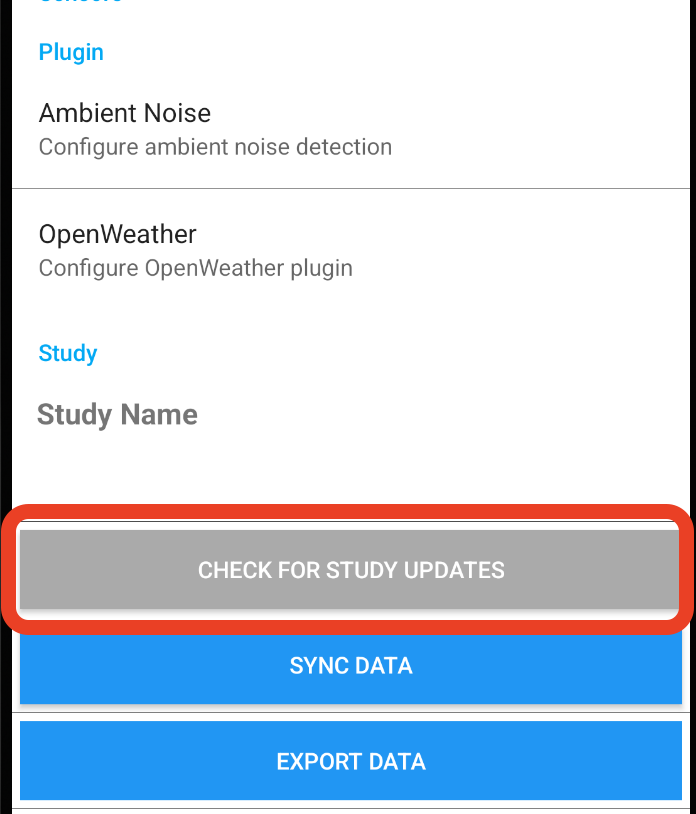
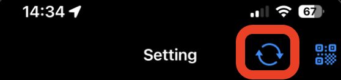

# AWARE Dashboard

A self-hosted research platform for collecting and visualising sensor data from Android and iOS devices. The entire stack is bundled into a single Docker Compose project that you can deploy with one command.

## What it is

Study participants install the **AWARE client app** on their phone (Android or iOS). The app continuously collects sensor data — accelerometer, GPS, screen events, ambient noise, and [many more](#sensor-support). Due to security restrictions on both Android and iOS, participants must **manually trigger a data upload** from inside the app. Once they do, the data is sent to your server and becomes immediately available in the analytics dashboard for browsing, filtering, and export.

The full stack comprises six services:

| Service                                                                        | Role                                                                                        |
| ------------------------------------------------------------------------------ | ------------------------------------------------------------------------------------------- |
| **Nginx**                                                                      | Reverse proxy — routes all public traffic, terminates TLS, enforces authentication          |
| **Analytics API**                                                              | FastAPI backend for the dashboard — queries the database and serves sensor data and exports |
| **Analytics Dashboard**                                                        | React frontend — visualises collected data per device and sensor; exports CSVs and ZIPs     |
| [**AWARE Configurator**](https://github.com/awareframework/AWARE-Configurator) | Django + React app for building and publishing study configurations for Android and iOS     |
| [**AWARE Micro Server**](https://github.com/awareframework/aware-micro-server) | Kotlin / Vert.x server that receives data uploads from iOS clients and writes them to MySQL |
| **MySQL + backup**                                                             | Shared database for all collected data, with a configurable automated backup job            |

A browser-based **setup wizard** is included for the initial deployment — it writes your configuration and launches the stack without any manual file editing.

### Client apps

Study participants need the AWARE mobile app installed on their device:

- **Android** and **iOS** clients are available at [awareframework.com/downloads](https://awareframework.com/downloads/)

Once a participant joins a study (by scanning a QR code or entering a study URL), the app begins collecting sensor data locally and waits for the participant to manually sync it to the server.

## Prerequisites

### Docker with Compose v2

The entire stack runs in Docker. No other runtime (Node, Java, etc.) needs to be installed on the host.

| Platform | What to install                                                                                                             |
| -------- | --------------------------------------------------------------------------------------------------------------------------- |
| macOS    | [Docker Desktop](https://www.docker.com/products/docker-desktop/) — Compose v2 is included                                  |
| Windows  | [Docker Desktop](https://www.docker.com/products/docker-desktop/) — Compose v2 is included                                  |
| Linux    | [Docker Engine](https://docs.docker.com/engine/install/) + [Compose plugin](https://docs.docker.com/compose/install/linux/) |

### Python 3

The setup scripts (`setup.sh` / `setup.bat`) run several Python 3 helper scripts directly on the host to generate config files and initialise the database. No third-party packages are required — only the Python standard library.

| Platform | How to get it                                                                                                         |
| -------- | --------------------------------------------------------------------------------------------------------------------- |
| macOS    | Pre-installed on most systems, or install via [Homebrew](https://brew.sh/): `brew install python3`                    |
| Windows  | Download from [python.org](https://www.python.org/downloads/) — tick **"Add Python to PATH"** during installation     |
| Linux    | Usually pre-installed. If not: `sudo apt install python3` (Debian/Ubuntu) or `sudo dnf install python3` (RHEL/Fedora) |

Verify with: `python3 --version` (Linux/macOS) or `python --version` (Windows).

### Git

| Platform | How to get it                                                                                                                 |
| -------- | ----------------------------------------------------------------------------------------------------------------------------- |
| macOS    | Pre-installed via Xcode Command Line Tools: `xcode-select --install`, or via [Homebrew](https://brew.sh/): `brew install git` |
| Windows  | Download from [git-scm.com](https://git-scm.com/download/win) — use the default options during installation                   |
| Linux    | `sudo apt install git` (Debian/Ubuntu) or `sudo dnf install git` (RHEL/Fedora)                                                |

Verify with: `git --version`.

### Network ports

| Port   | Purpose                                                          |
| ------ | ---------------------------------------------------------------- |
| `80`   | Main HTTP access — required                                      |
| `443`  | HTTPS — required only if you enable TLS                          |
| `9999` | Setup wizard — only needed temporarily during initial deployment |

If you are deploying on a remote server, open ports `80` and `443` in your firewall before running setup. Port `9999` only needs to be reachable from your own machine during the setup step and can be closed afterwards.

### SSL certificate (optional, recommended for remote servers)

If you want HTTPS, obtain a certificate for your domain before running setup — for example with [Let's Encrypt / Certbot](https://certbot.eff.org/). The setup wizard will ask for the paths to the certificate and private key files.

## How to perform the deployment

### 1. Open a terminal

You will type all the commands below into a terminal (command-line) window. Here is how to open one:

| OS          | How to open a terminal                                                                                         |
| ----------- | -------------------------------------------------------------------------------------------------------------- |
| **macOS**   | Press **⌘ + Space**, type **Terminal**, press Enter                                                            |
| **Windows** | Press **Win + S**, type **PowerShell**, right-click **Windows PowerShell** and choose **Run as administrator** |
| **Linux**   | Press **Ctrl + Alt + T**, or search for **Terminal** in your application menu                                  |

Once the terminal is open, you can copy each command below and paste it in, then press **Enter** to run it. Do this one command at a time and wait for each one to finish before moving to the next.

### 2. Clone the repository

When a terminal opens, it places you in a default location on your computer — usually your home folder (something like `C:\Users\yourname` on Windows or `/Users/yourname` on macOS). You can clone the project anywhere you like, but it is a good idea to keep code in a dedicated folder so it is easy to find later.

For example, to create a `dev` folder and clone into it:

```bash
mkdir dev
cd dev
git clone https://github.com/va13k/aware_dashboard.git
cd aware_dashboard
```

What each command does:

- `mkdir dev` — creates a new folder called `dev` in your current location
- `cd dev` — moves you into that folder
- `git clone ...` — downloads the project into a new subfolder called `aware_dashboard`
- `cd aware_dashboard` — moves you into the project folder

All following commands must be run from inside the `aware_dashboard` folder. You can confirm you are in the right place by checking that your terminal prompt shows `aware_dashboard` at the end of the path.

### 3. Run the setup script

Before running the script, **make sure Docker Desktop is open and fully started**. You should see the Docker whale icon in your taskbar (Windows) or menu bar (macOS) and it should not be showing a loading spinner — if it is still starting up, wait until it settles before continuing.

> On Linux, Docker runs as a background service and does not need a Desktop app — you can skip this step.

Once Docker is running, start the guided setup wizard with the command that matches your operating system:

**macOS / Linux:**

```bash
./setup.sh
```

**Windows (PowerShell):**

```bat
./setup.bat
```

> **Windows note:** If you get a message saying the script is not recognised, make sure you are in the `aware_dashboard` folder (you should see it in the prompt) and that Docker Desktop is running before you try again.

The script checks that Docker and Python 3 are available, then does the following automatically:

1. **Detects your machine's IP address** — it inspects your network interfaces and picks the best non-loopback, non-virtual address (e.g. `192.168.1.42`). It avoids Docker bridge interfaces, VPN adapters, and loopback.
2. **Starts the setup wizard** as a temporary Docker container on port `9999`.
3. **Prints the wizard URL** in the terminal — it looks like:
   ```
   http://192.168.1.42:9999/KL0XF9tXQVC4LRY-gCTRDWEQhO6II3IOLxU4/
   ```
   The path contains a one-time random token that is valid for this session only.
4. **Tries to open the URL in your browser** automatically (macOS and Linux with a desktop). On a headless server, this step does nothing — see [Remote server deployment](#remote-server-deployment) below.

Once the setup page opens in your browser — either automatically or after you copied the URL from the terminal — you are ready to continue. **Proceed to [Step 3 — Complete the setup wizard](#3-complete-the-setup-wizard).**

### Re-running setup

If `.env` and `aware-micro-server/aware-config.json` already exist, the script detects them and offers a choice:

```
  Existing configuration found (.env)

  1) Deploy with current config
  2) Edit configuration first

  Choose [1/2]:
```

- **Option 1** — skips the wizard and redeploys immediately with the saved config.
- **Option 2** — opens the wizard again so you can change any settings before deploying.

### Remote server deployment

On a Linux server without a graphical desktop, the browser cannot open automatically. The URL is still printed in the terminal — copy it and open it from your own computer.

For the wizard to be reachable from your computer, the server's port `9999` must be accessible. Two ways to do this:

**Option A — SSH tunnel (recommended, no firewall changes needed)**

```bash
ssh -L 9999:localhost:9999 your-user@your-server-ip
```

Then open `http://localhost:9999/<token>/` on your local machine.

**Option B — Temporarily open port 9999**

Open port `9999` in your firewall, copy the full URL the script printed, open it in your browser, complete setup, then close the port again.

### 3. Complete the setup wizard

The wizard has five steps. A progress bar at the top tracks where you are. You can go back to any previous step before deploying.

---

**Step 1 — Database**

Set the **MySQL root password**. All services (Configurator, Micro Server, Analytics API) use this password internally to connect to the database. Choose a strong password and keep it somewhere safe — you will need it if you ever need to access MySQL directly.

---

**Step 2 — Researcher access**

Set the **username and password** for the researcher login. These credentials protect the dashboard, configurator, and backup pages from being accessed by study participants.

- The username defaults to `researcher` on a fresh install.
- Use the **Generate** button to create a random secure password.
- On a re-run, the username is pre-filled from the existing config. Leave the password field blank to keep the current password unchanged.

Save these credentials — you will need them every time you log in to the protected pages.

---

**Step 3 — Network**

Configure how the platform is reached from the outside.

**Public host or IP** — a dropdown with three options:

| Option                      | When to use                                                                                       |
| --------------------------- | ------------------------------------------------------------------------------------------------- |
| Use detected local IP       | Default. Use this for local or LAN deployments where the auto-detected IP is correct.             |
| Use localhost               | Use only if everything (server and browser) runs on the same machine.                             |
| Enter another host manually | Use this when you have a domain name (e.g. `study.example.com`) or when the detected IP is wrong. |

**Enable HTTPS** — toggle this on if you have SSL certificates. Two additional fields appear:

- **Certificate path** — path to your `fullchain.pem` file (default: `./certs/fullchain.pem`)
- **Key path** — path to your `privkey.pem` file (default: `./certs/privkey.pem`)

Both paths can be relative to the project folder or absolute.

---

**Step 4 — Backups**

Configure automated MySQL backups. Backups are saved directly on the host machine (outside Docker volumes) so they survive a `docker compose down -v`.

- **Backup folder** — where to save the backup files. Relative paths are resolved from the project folder. The path must not contain spaces.
- **Backup interval** — how often a backup runs, in days (default: 1).
- **Keep backups for** — how many days to retain backups before they are deleted (default: 30).

---

**Step 5 — Review**

Shows a preview of the `.env` file that will be written. Review the values and click **Deploy** when ready.

---

**Deploying**

After you click Deploy, the wizard:

1. Writes `.env`, `aware-micro-server/aware-config.json`, and `studies/index.html`
2. Builds all Docker images
3. Starts all seven services and polls their health checks every 1.5 seconds
4. Shows which services are still starting (e.g. `Waiting for: mysql, configurator`)
5. On success — displays the researcher credentials one final time and redirects your browser to the main page after 2.5 seconds

If deployment fails, an error message is shown and an **Edit configuration** button lets you go back and fix the settings.

### 4. What you can access

Once deployment is complete, open the main page at `http://your-host/` (or `https://` if you enabled TLS).

The main page links to all four sections of the platform:

| Page                    | URL              | Access                     |
| ----------------------- | ---------------- | -------------------------- |
| **Studies**             | `/studies/`      | Public — no login required |
| **Configurator**        | `/configurator/` | Researcher login required  |
| **Analytics Dashboard** | `/dashboard/`    | Researcher login required  |
| **Backup & Restore**    | `/backup/`       | Researcher login required  |

**Studies** is intentionally public so that study participants can reach it without credentials. It shows the available study configurations and QR codes that participants use to join a study with the AWARE app.

All other pages are protected. When you navigate to any of them without being logged in, you are redirected to the researcher login page. Enter the username and password you set in step 2 of the wizard to gain access. The session lasts 8 hours; after that you will be asked to log in again.

### 5. Configure the study in the Configurator

The Configurator (`/configurator/`) is the central control panel for your study. It determines what data is collected and when participants are asked questions — for both Android and iOS devices. Open it, log in with your researcher credentials, and work through its four pages.

---

**Page 1 — Study Information**

Fill in the basic details that participants see when they join the study:

- **Study title** — displayed in the AWARE app after joining
- **Study description** — explains the study purpose to participants
- **Researcher's first and last name**
- **Researcher's contact email** — participants can use this to reach you

All five fields are required before you can proceed.

---

**Page 2 — Study Questions (ESM)**

ESM stands for Experience Sampling Method — timed in-app questionnaires pushed to participants' phones. Add as many questions as you need; each question can be independently configured.

Each question requires:

- **Type** — choose from: Free Text, Single Choice (radio), Multiple Choice (checkbox), Likert Scale, Quick Answer, Scale, or Numeric
- **Title** — the question text shown to the participant
- **Submit button label** — defaults to "Submit"
- **Answer options** — for choice-based types, add one option per line

Questions can be reordered and deleted. They are only sent to participants when assigned to a schedule (next page).

---

**Page 3 — Schedule Configuration**

Schedules control when ESM questions are delivered. Add one or more schedules and configure each one:

- **Hours** — tick the hours of the day when questions should be triggered (e.g. 09:00, 12:00, 18:00). At each selected hour the app will show the assigned questions.
- **Questions** — select which questions from page 2 belong to this schedule. Each schedule can contain any subset of questions.

Multiple schedules can run in parallel with different questions and different delivery times.

---

**Page 4 — Sensors**

This is the most detailed page. It controls which device sensors are active during the study and how they behave. Changes here affect both Android and iOS participants.

**Upload settings** (apply to all sensors on all platforms):

| Setting                 | Description                                                                               |
| ----------------------- | ----------------------------------------------------------------------------------------- |
| Wi-Fi only              | Upload data only when connected to Wi-Fi                                                  |
| Charging only           | Upload only while the device is charging                                                  |
| Offload frequency       | How often to sync data to the server (minutes)                                            |
| Clean data frequency    | How often to delete already-synced local data (Never / Monthly / Weekly / Daily / Always) |
| Fallback network        | Hours of failed Wi-Fi sync before falling back to mobile data                             |
| Config update frequency | How often the app checks for study config changes (minutes)                               |
| Silent                  | Suppress sync notifications on the device                                                 |
| Foreground priority     | Keep AWARE running continuously as a foreground service                                   |

**Shared sensors** (available on both Android and iOS):

Battery, Screen, Timezone, Accelerometer, Barometer, Bluetooth, Communication (calls), Gyroscope, Linear Accelerometer, Locations (GPS + network), Magnetometer, Network, Processor, Rotation, Significant Motion, Wi-Fi.

Each sensor can be toggled on or off individually. Many expose additional sub-settings when enabled — for example:

- **Accelerometer / Gyroscope / Barometer / etc.** — sampling frequency (in microseconds) and a change threshold to reduce noise
- **Locations** — separate GPS and network provider toggles, frequency, and minimum accuracy in metres
- **Bluetooth / Wi-Fi** — scan frequency in seconds
- **Communication** — Android-only sub-sensors for message logging and communication events

**Android-only sensors**: Gravity, Light, Proximity, Temperature, Applications (with sub-options: notifications, crashes, keyboard logging, on-screen text tracking, app package filter), App Installations, Telephony, MQTT, Screenshot (interval, compression, app filter), Taking Note.

**iOS-only sensors**: Activity Recognition, Contacts sync, Fitbit (steps, heart rate, sleep — requires API key), Google Login, Conversation detection, Fused Location, Device Usage, Calendar, Google Calendar ESM Scheduler, Headphone Motion, HealthKit (sync frequency + historical pre-period), Heart Rate via BLE, NTP clock offset, Pedometer, Push Notification.

**Shared plugins** (Android and iOS):

| Plugin        | Key settings                                                                    |
| ------------- | ------------------------------------------------------------------------------- |
| ESM Scheduler | Enables the question/schedule system from pages 2–3                             |
| Ambient Noise | Sampling frequency (minutes), sample duration (seconds), silence threshold (dB) |
| OpenWeather   | Update frequency (minutes), API key, metric or imperial units                   |

---

**Page 5 — Overview**

Shows a summary of the complete study configuration. When everything looks correct, click **Download Study Config** to save the file. The configuration is written to `studies/` and immediately served at `/studies/` for participants to use.

---

> **Important — participants must manually apply config updates.**
>
> Every time you change anything in the Configurator and download a new study config, participants will not pick up the changes automatically. They need to refresh the study config from inside the AWARE app:
>
> - **Android** — open the AWARE app and tap the **CHECK FOR STUDY UPDATES** button.
>
> 
>
> - **iPhone** — open the AWARE app and tap the **update button** in the top-right corner, to the left of the QR-code button.
>
> 
>
> Until participants do this, their app continues running the old configuration.

### 6. Browse collected data in the Analytics Dashboard

The Analytics Dashboard (`/dashboard/`) is the researcher's main window into the collected sensor data. It has two main views — **Overview** and **Per Device** — plus a **Manifest** page.

---

**Overview** (`/dashboard/`)

The default view gives a cross-device snapshot of the entire dataset.

- **Last upload banner** — shows the date and a live "X ago" label (refreshed every 10 seconds) of the most recent data upload across all enrolled devices. If no data has arrived yet it shows "No uploads yet".
- **Export all** button — downloads a single ZIP file containing all sensor data as CSVs, across all devices and both platforms, for offline analysis.
- **Manifest** button — opens the Manifest page (see below).
- **Sensor cards grid** — one card per sensor type, organised into three sections: Shared (available on both platforms), Android only, and iPhone only. Each card shows the record count for Android and iOS and a small visual indicator of the data. Sensors with no data are shown in a muted style.
- **"Only sensors with records" toggle** — hides sensor cards that have received no data yet, letting you focus on what's actually been collected. The preference is saved in the browser and persists across sessions and page refreshes.
- The entire page **auto-refreshes every 60 seconds** without any user action.

---

**Per Device** (`/dashboard/devices/`)

Drill down into an individual participant's data.

- **Device list** (left sidebar) — every enrolled device across both platforms is listed, showing the platform label (Android / iOS), device name (manufacturer + model for Android; label or model for iOS), truncated device ID, and time since the last upload.
- **Click any device** to load it. The URL updates so you can bookmark or share a direct link to a specific device (`/dashboard/devices/android/<id>` or `/dashboard/devices/ios/<id>`).
- **Device info panel** — shows device ID, last seen time, number of active sensors, total record count, and the field values from the most recent upload payload.
- **ZIP export** button — downloads all sensor CSVs for that device in one archive.
- **Sensor cards** — the same sensor card grid as the Overview, but scoped to this device only. Cards are split into Shared and platform-specific sections. Each card has its own individual CSV export button.
- The **"Only sensors with records" toggle** is shared with the Overview page.
- Data **polls every 60 seconds** while a device is selected.

---

**Manifest** (`/dashboard/manifest`)

A research-grade inventory of the complete dataset — useful for understanding what has been collected before exporting or archiving.

- **Summary stats** at the top: Android device count, iOS device count, total record count across all sensors, and the overall study date span (date of first sample to date of last sample).
- **Per-platform breakdown** — for each sensor on Android and iOS, a row shows:
  - Total record count
  - Number of devices that have contributed data for that sensor / total device count
  - Date of the first sample
  - Date of the last sample
  - Number of database fields, expandable to show the full field name list
- Sensors are **sorted by record count** (most data first). Sensors with no data are listed dimmed at the bottom.
- **Download JSON** button — exports the full manifest as a structured JSON file, useful for archiving dataset metadata alongside the raw CSVs.

## Sensor support

The table below lists every sensor the dashboard can display, as configured in the Analytics Dashboard. For full documentation on each sensor visit the [official AWARE sensor reference](https://awareframework.com/sensors/).

| Sensor                    | Android | iOS | Unit  |
| ------------------------- | :-----: | :-: | ----- |
| Accelerometer             |    ✓    |  ✓  | g     |
| Ambient Noise             |    ✓    |  ✓  | dB    |
| Barometer                 |    ✓    |  ✓  | hPa   |
| Battery Level             |    ✓    |  ✓  | %     |
| Battery Charges           |    ✓    |  ✓  | event |
| Battery Discharges        |    ✓    |  ✓  | event |
| Bluetooth RSSI            |    ✓    |  ✓  | dBm   |
| Calls                     |    ✓    |  ✓  | event |
| Gyroscope                 |    ✓    |  ✓  | rad/s |
| Linear Accelerometer      |    ✓    |  ✓  | g     |
| Location                  |    ✓    |  ✓  | m/s   |
| Magnetometer              |    ✓    |  ✓  | μT    |
| Network                   |    ✓    |  ✓  | event |
| OpenWeather               |    ✓    |  ✓  | °C    |
| Processor                 |    ✓    |  ✓  | %     |
| Rotation                  |    ✓    |  ✓  | rad/s |
| Screen Status             |    ✓    |  ✓  |       |
| Significant Motion        |    ✓    |  ✓  |       |
| Timezone                  |    ✓    |  ✓  | event |
| ESM/EMA                   |    ✓    |  ✓  | event |
| WiFi                      |    ✓    |  ✓  |       |
| Application Crashes       |    ✓    |  —  | event |
| Application History       |    ✓    |  —  | event |
| Application Notifications |    ✓    |  —  | event |
| Applications              |    ✓    |  —  | event |
| Gravity                   |    ✓    |  —  | g     |
| Installations             |    ✓    |  —  | event |
| Keyboard                  |    ✓    |  —  | event |
| Light                     |    ✓    |  —  | lux   |
| Messages                  |    ✓    |  —  | event |
| Network Traffic           |    ✓    |  —  | bytes |
| Notes                     |    ✓    |  —  | event |
| Proximity                 |    ✓    |  —  |       |
| Screen Text               |    ✓    |  —  | event |
| Telephony                 |    ✓    |  —  | event |
| Temperature               |    ✓    |  —  | °C    |
| Touch                     |    ✓    |  —  | event |
| Activity Recognition      |    —    |  ✓  | event |
| Calendar                  |    —    |  ✓  | event |
| Contacts                  |    —    |  ✓  | event |
| Conversation              |    —    |  ✓  | event |
| Device Usage              |    —    |  ✓  | event |
| ESM Scheduler             |    —    |  ✓  | event |
| Fitbit                    |    —    |  ✓  | event |
| Fitbit Data               |    —    |  ✓  |       |
| Fitbit Device             |    —    |  ✓  | event |
| Fused Location            |    —    |  ✓  | m     |
| Google Calendar ESM       |    —    |  ✓  | event |
| Headphone Motion          |    —    |  ✓  | m/s²  |
| Heart Rate (BLE)          |    —    |  ✓  | bpm   |
| HealthKit                 |    —    |  ✓  |       |
| HealthKit Category        |    —    |  ✓  | event |
| HealthKit Quantity        |    —    |  ✓  |       |
| HealthKit Workout         |    —    |  ✓  | event |
| Location Visit            |    —    |  ✓  | event |
| Memory                    |    —    |  ✓  |       |
| NTP                       |    —    |  ✓  | ms    |
| Pedometer                 |    —    |  ✓  | steps |
| Push Notification         |    —    |  ✓  | event |
